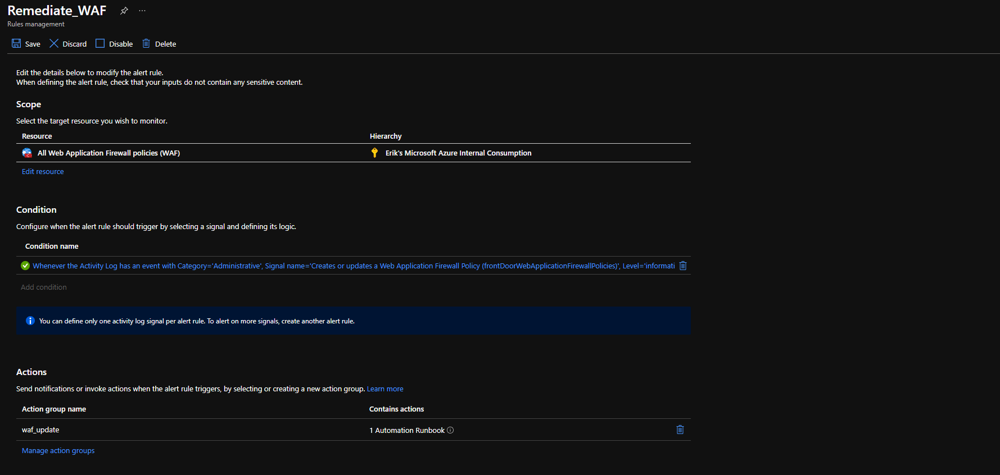
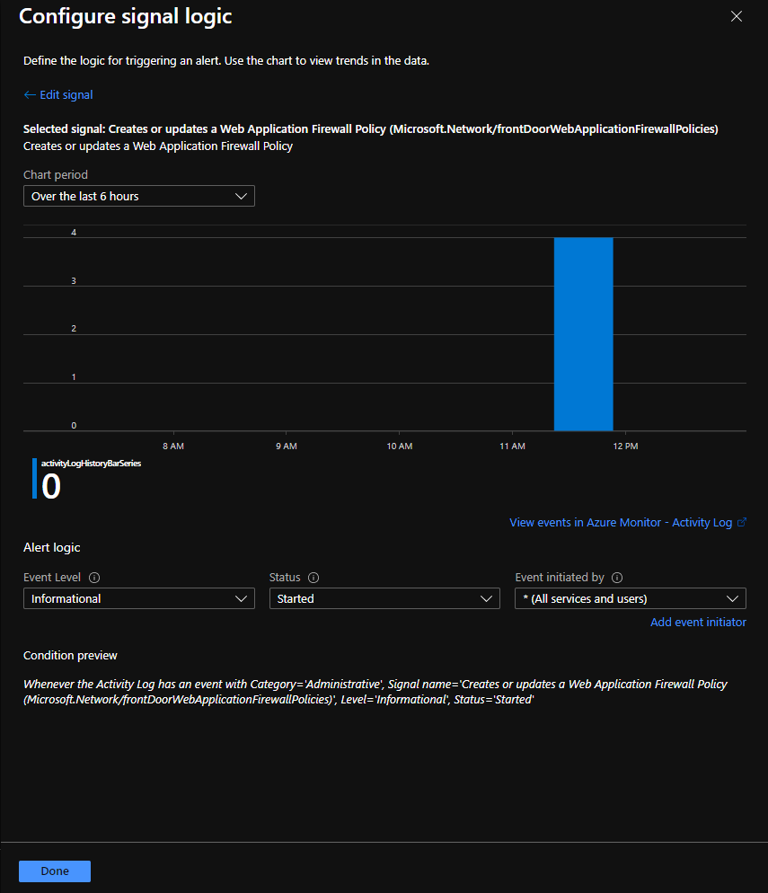
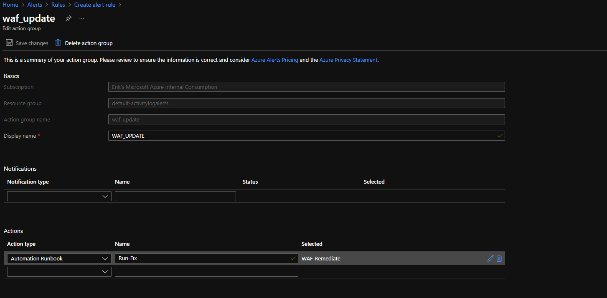
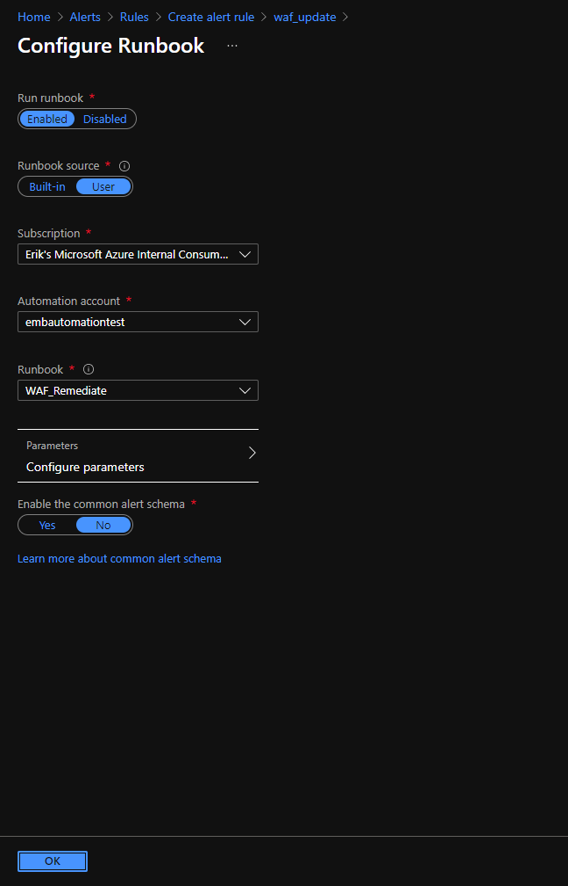

# wafpolicyautomation
Powershell Runbook for Azure Automation to govern WAF Policy changes.  

You can use this script with Azure Automation and Azure Monitor Alerts to trigger when changes are made to WAF Policies.  This script will enforce the "default" setup that you choose.

Create a new PowerShell runbook in your chosen Automation Account.

# Note:  You need the following modules enabled in your Azure Automation Account:

Az.Accounts

Az.Frontdoor

---

Setup Alert definition as follows.

Alert Rule Definition:

Alert Rule Logic:

Action Setup:

Runbook Setup:

